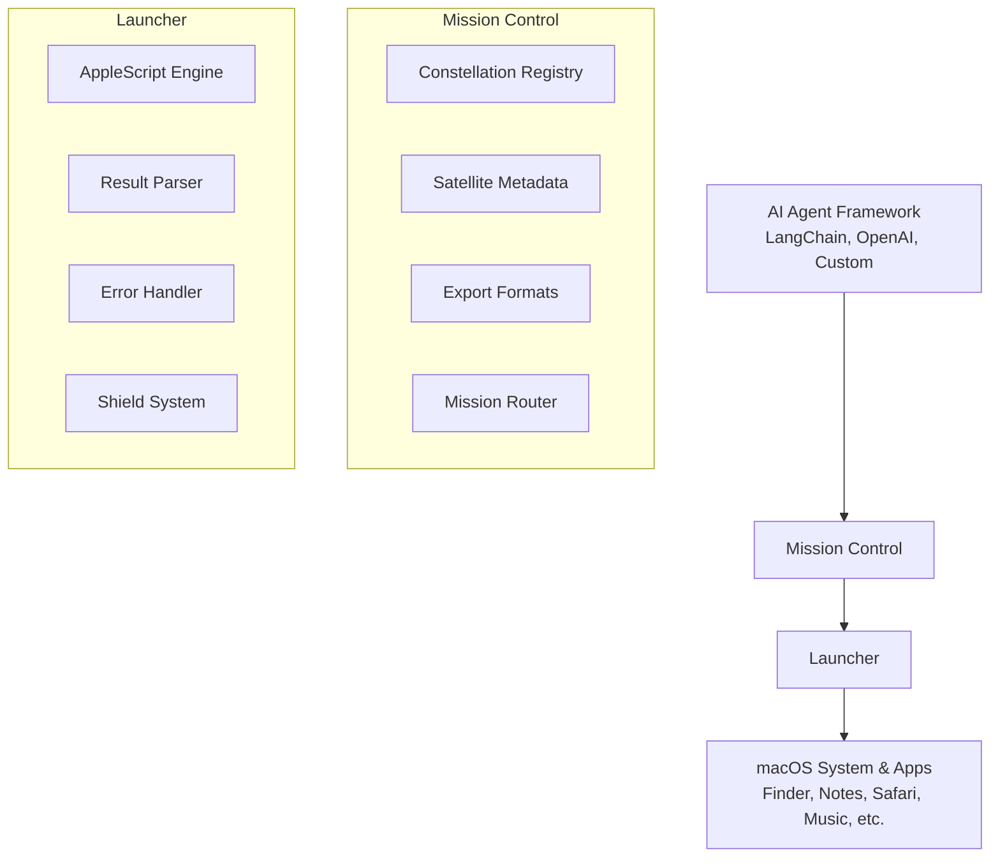

# Orbit 🛸

> **Put macOS automation in orbit**

Orbit is a framework-agnostic toolkit that empowers AI agents to seamlessly interact with macOS through AppleScript. Whether you're building with LangChain, OpenAI Functions, or a custom agent framework, Orbit provides standardized, safe, and extensible tools for macOS automation.

---

## 🌟 Features

- **Framework Agnostic** - Works with any LLM/Agent framework
- **Standardized Interface** - Unified function calling conventions
- **Safety First** - Built-in permission management and security checks
- **Highly Extensible** - Add new tools without modifying core code
- **100+ Satellite Tools** - Comprehensive coverage of macOS capabilities

---

## 🚀 Quick Start

### Installation

```bash
pip install orbit-macos
```

### Basic Usage

```python
from orbit import MissionControl

# Initialize mission control
mission = MissionControl()

# Register your satellite tools
from orbit.satellites import all_satellites
mission.register_constellation(all_satellites)

# Launch a mission
result = mission.launch(
    "system_get_info",
    parameters={}
)

print(result)
# {
#   "version": "14.0",
#   "hostname": "MacBook-Pro",
#   "username": "astronaut",
#   "architecture": "arm64"
# }
```

---

## 🛰️ Satellite Constellation

Orbit provides a comprehensive constellation of satellite tools organized into categories:

### System Telemetry
- `system_get_info` - Get macOS system information
- `system_get_clipboard` - Read clipboard contents
- `system_set_clipboard` - Set clipboard contents
- `system_send_notification` - Send system notification
- `system_take_screenshot` - Capture screen
- `system_get_volume` - Get current volume level
- `system_set_volume` - Set volume level
- `system_get_brightness` - Get screen brightness
- `system_set_brightness` - Set screen brightness

### File Communications
- `file_list` - List files in directory
- `file_read` - Read file contents
- `file_write` - Write to file
- `file_delete` - Delete file
- `file_move` - Move file
- `file_copy` - Copy file
- `file_search` - Search files
- `file_empty_trash` - Empty trash

### App Stations
- **Notes** - Create, read, update, delete, search notes
- **Reminders** - Manage reminders and lists
- **Calendar** - Create and manage events
- **Mail** - Send and read emails
- **Safari** - Control browser, tabs, search
- **Music** - Control playback and library
- **Contacts** - Search and retrieve contacts
- **Finder** - Navigate and manage folders

### Network & WiFi
- `wifi_connect` - Connect to network
- `wifi_disconnect` - Disconnect
- `wifi_list` - List available networks
- `wifi_current` - Current connection info

### Application Control
- `app_list` - List installed applications
- `app_launch` - Launch application
- `app_quit` - Quit application
- `app_activate` - Bring to front

[View complete satellite list](https://github.com/yourusername/orbit/docs/SATELLITES.md)

---

## 🌍 Mission Control Architecture



---

## 🛡️ Shield System (Safety)

Orbit implements a 4-tier safety system to protect your system:

### Safety Levels

| Level | Description | Auto-Allow | Confirmation |
|-------|-------------|------------|--------------|
| **SAFE** | Read-only operations | ✅ | ❌ |
| **MODERATE** | Create/modify operations | ❌ | ⚠️ Suggested |
| **DANGEROUS** | Delete operations | ❌ | ✅ Required |
| **CRITICAL** | System-level operations | ❌ | ✅ Required + Blocklist |

### Example: Configuring Safety

```python
from orbit import MissionControl, SafetyShield
from orbit.satellites import SafetyLevel

# Create shield with custom rules
shield = SafetyShield(
    rules={
        SafetyLevel.SAFE: "allow",
        SafetyLevel.MODERATE: "confirm",
        SafetyLevel.DANGEROUS: "deny",  # Block dangerous ops
        SafetyLevel.CRITICAL: "deny"
    },
    confirmation_callback=lambda tool, params: input(f"Allow {tool.name}? (y/n): ") == "y"
)

mission = MissionControl(safety_shield=shield)
```

---

## 🔗 Framework Integration

### OpenAI Functions

```python
import openai
from orbit import MissionControl
from orbit.satellites import all_satellites

mission = MissionControl()
mission.register_constellation(all_satellites)

# Export as OpenAI Functions
functions = mission.export_openai_functions()

response = openai.chat.completions.create(
    model="gpt-4",
    messages=[{"role": "user", "content": "Create a note about my meeting"}],
    functions=functions,
    function_call="auto"
)

# Execute function call
if response.choices[0].message.function_call:
    result = mission.execute_function_call(response.choices[0].message)
    print(result)
```

### LangChain

```python
from langchain.agents import initialize_agent, AgentType
from langchain_openai import ChatOpenAI
from langchain.tools import StructuredTool
from orbit import MissionControl

mission = MissionControl()
mission.register_constellation(all_satellites)

# Convert to LangChain tools
langchain_tools = [
    StructuredTool.from_function(
        func=lambda **kwargs: mission.launch(tool.name, kwargs),
        name=tool.name,
        description=tool.description,
    )
    for tool in mission.constellation.list_all()
]

# Create agent
llm = ChatOpenAI(model="gpt-4")
agent = initialize_agent(
    langchain_tools,
    llm,
    agent=AgentType.OPENAI_FUNCTIONS,
    verbose=True
)

agent.run("Create a reminder for my meeting tomorrow at 3pm")
```

### Custom Agent

```python
from orbit import MissionControl

mission = MissionControl()
mission.register_constellation(all_satellites)

# Simple agent loop
def run_agent(user_prompt: str):
    # Get LLM response (simplified)
    llm_response = your_llm.generate(
        prompt=user_prompt,
        tools=mission.export_openai_functions()
    )

    # Execute tool call
    if llm_response.function_call:
        result = mission.execute_function_call(llm_response.function_call)
        return result

    return llm_response.text
```

---

## 🔧 Development Status

### Current Phase: Core Framework
- [x] Architecture design
- [x] Safety system design
- [x] Tool registry specification
- [ ] Core implementation (in progress)
- [ ] First satellite tools

### Roadmap

**Phase 1: Core Framework** (Week 1-2)
- Satellite base class and data structures
- Constellation registry
- Mission launcher (AppleScript runner)
- Shield system (safety checker)
- Exception handling

**Phase 2: System Telemetry** (Week 3)
- System info, clipboard, notifications
- Screenshots, volume, brightness

**Phase 3: File Communications** (Week 4)
- File operations (list, read, write, delete, move, copy)
- Search and trash

**Phase 4: App Stations** (Week 5-6)
- Notes, Reminders, Calendar
- Mail, Safari, Music

**Phase 5: Advanced Satellites** (Week 7-8)
- Finder operations
- Application control
- Contacts, WiFi

**Phase 6: Integration & Docs** (Week 9-10)
- Framework integrations
- Examples and tutorials
- API documentation

---

## 🤝 Contributing

We welcome contributions! Please see our [Contributing Guide](https://github.com/yourusername/orbit/docs/CONTRIBUTING.md) for details.

### Development Setup

```bash
# Clone the repository
git clone https://github.com/yourusername/orbit.git
cd orbit

# Install in development mode
pip install -e ".[dev]"

# Run tests
pytest

# Run linting
ruff check .
black --check .
```

---

## 📄 License

MIT License - see [LICENSE](https://github.com/yourusername/orbit/LICENSE) for details.

---

## 🌟 Acknowledgments

Built with ❤️ for the macOS automation community.

Orbit: Your AI's bridge to macOS. 🛸
