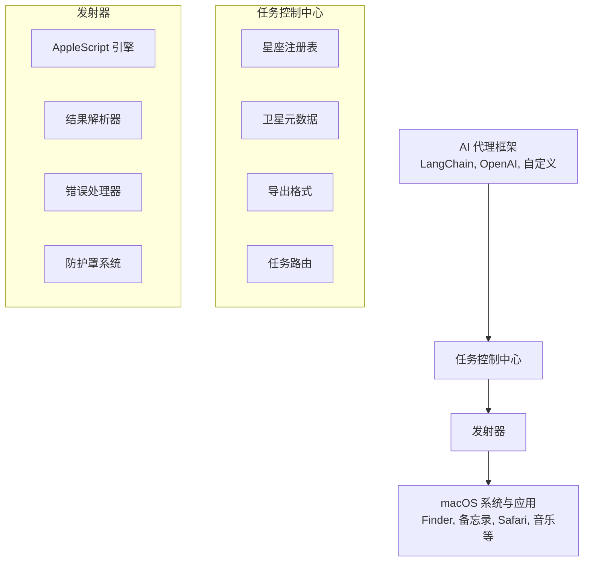

# Orbit 🛸

> **让 macOS 自动化进入轨道**

Orbit 是一个框架无关的工具包，通过 AppleScript 赋能 AI 代理无缝操作 macOS。无论你使用的是 LangChain、OpenAI Functions 还是自定义代理框架，Orbit 都能提供标准化、安全且可扩展的 macOS 自动化工具。

---

## 🌟 特性

- **框架无关** - 可与任何 LLM/代理框架配合使用
- **标准化接口** - 统一的函数调用规范
- **安全优先** - 内置权限管理和安全检查
- **高度可扩展** - 无需修改核心代码即可添加新工具
- **100+ 卫星工具** - 全面覆盖 macOS 能力

---

## 🚀 快速开始

### 安装

```bash
pip install orbit-macos
```

### 基础用法

```python
from orbit import MissionControl

# 初始化任务控制中心
mission = MissionControl()

# 注册卫星工具
from orbit.satellites import all_satellites
mission.register_constellation(all_satellites)

# 发射任务
result = mission.launch(
    "system_get_info",
    parameters={}
)

print(result)
# {
#   "version": "14.0",
#   "hostname": "MacBook-Pro",
#   "username": "astronaut",
#   "architecture": "arm64"
# }
```

---

## 🛰️ 卫星星座

Orbit 提供按类别组织的全面卫星工具：

### 系统遥测
- `system_get_info` - 获取 macOS 系统信息
- `system_get_clipboard` - 读取剪贴板内容
- `system_set_clipboard` - 设置剪贴板内容
- `system_send_notification` - 发送系统通知
- `system_take_screenshot` - 截屏
- `system_get_volume` - 获取音量
- `system_set_volume` - 设置音量
- `system_get_brightness` - 获取屏幕亮度
- `system_set_brightness` - 设置屏幕亮度

### 文件通讯
- `file_list` - 列出目录文件
- `file_read` - 读取文件内容
- `file_write` - 写入文件
- `file_delete` - 删除文件
- `file_move` - 移动文件
- `file_copy` - 复制文件
- `file_search` - 搜索文件
- `file_empty_trash` - 清空废纸篓

### 应用站点
- **备忘录** - 创建、读取、更新、删除、搜索笔记
- **提醒事项** - 管理提醒和列表
- **日历** - 创建和管理事件
- **邮件** - 发送和阅读邮件
- **Safari** - 控制浏览器、标签页、搜索
- **音乐** - 控制播放和音乐库
- **通讯录** - 搜索和获取联系人
- **Finder** - 导航和管理文件夹

### 网络与 WiFi
- `wifi_connect` - 连接网络
- `wifi_disconnect` - 断开连接
- `wifi_list` - 列出可用网络
- `wifi_current` - 当前连接信息

### 应用控制
- `app_list` - 列出已安装应用
- `app_launch` - 启动应用
- `app_quit` - 退出应用
- `app_activate` - 激活应用

[查看完整卫星列表](docs/SATELLITES_CN.md)

---

## 🌍 任务控制架构



---

## 🛡️ 防护罩系统（安全）

Orbit 实现了四级安全系统来保护您的系统：

### 安全等级

| 等级 | 描述 | 自动允许 | 需要确认 |
|------|------|----------|----------|
| **SAFE（安全）** | 只读操作 | ✅ | ❌ |
| **MODERATE（中等）** | 创建/修改操作 | ❌ | ⚠️ 建议 |
| **DANGEROUS（危险）** | 删除操作 | ❌ | ✅ 必需 |
| **CRITICAL（严重）** | 系统级操作 | ❌ | ✅ 必需 + 黑名单 |

### 示例：配置安全

```python
from orbit import MissionControl, SafetyShield
from orbit.satellites import SafetyLevel

# 创建自定义规则防护罩
shield = SafetyShield(
    rules={
        SafetyLevel.SAFE: "allow",
        SafetyLevel.MODERATE: "confirm",
        SafetyLevel.DANGEROUS: "deny",  # 阻止危险操作
        SafetyLevel.CRITICAL: "deny"
    },
    confirmation_callback=lambda tool, params: input(f"允许 {tool.name}? (y/n): ") == "y"
)

mission = MissionControl(safety_shield=shield)
```

---

## 🔗 框架集成

### OpenAI Functions

```python
import openai
from orbit import MissionControl
from orbit.satellites import all_satellites

mission = MissionControl()
mission.register_constellation(all_satellites)

# 导出为 OpenAI Functions 格式
functions = mission.export_openai_functions()

response = openai.chat.completions.create(
    model="gpt-4",
    messages=[{"role": "user", "content": "创建一个关于我会议的笔记"}],
    functions=functions,
    function_call="auto"
)

# 执行函数调用
if response.choices[0].message.function_call:
    result = mission.execute_function_call(response.choices[0].message)
    print(result)
```

### LangChain

```python
from langchain.agents import initialize_agent, AgentType
from langchain_openai import ChatOpenAI
from langchain.tools import StructuredTool
from orbit import MissionControl

mission = MissionControl()
mission.register_constellation(all_satellites)

# 转换为 LangChain 工具
langchain_tools = [
    StructuredTool.from_function(
        func=lambda **kwargs: mission.launch(tool.name, kwargs),
        name=tool.name,
        description=tool.description,
    )
    for tool in mission.constellation.list_all()
]

# 创建代理
llm = ChatOpenAI(model="gpt-4")
agent = initialize_agent(
    langchain_tools,
    llm,
    agent=AgentType.OPENAI_FUNCTIONS,
    verbose=True
)

agent.run("为明天下午3点的会议创建一个提醒")
```

---

## 📖 文档

- [快速入门指南](docs/QUICKSTART_CN.md) - 5分钟上手
- [API 参考文档](docs/API_REFERENCE_CN.md) - 完整 API 文档
- [完整卫星列表](docs/SATELLITES_CN.md) - 100+ 卫星工具
- [安全模型](docs/SECURITY_CN.md) - 安全架构详解
- [贡献指南](docs/CONTRIBUTING_CN.md) - 贡献指南

---

## 🔧 开发状态

### 当前阶段：核心框架
- [x] 架构设计
- [x] 安全系统设计
- [x] 工具注册规范
- [ ] 核心实现（进行中）
- [ ] 首批卫星工具

### 开发路线图

**第一阶段：核心框架**（第 1-2 周）
- 卫星基类和数据结构
- 星座注册表
- 任务发射器（AppleScript 运行器）
- 防护罩系统（安全检查器）
- 异常处理

**第二阶段：系统遥测**（第 3 周）
- 系统信息、剪贴板、通知
- 截屏、音量、亮度

**第三阶段：文件通讯**（第 4 周）
- 文件操作（列表、读取、写入、删除、移动、复制）
- 搜索和废纸篓

**第四阶段：应用站点**（第 5-6 周）
- 备忘录、提醒事项、日历
- 邮件、Safari、音乐

**第五阶段：高级卫星**（第 7-8 周）
- Finder 操作
- 应用控制
- 通讯录、WiFi

**第六阶段：集成与文档**（第 9-10 周）
- 框架集成
- 示例和教程
- API 文档

---

## 🤝 贡献

我们欢迎贡献！请查看我们的[贡献指南](docs/CONTRIBUTING_CN.md)。

### 开发设置

```bash
# 克隆仓库
git clone https://github.com/yourusername/orbit.git
cd orbit

# 以开发模式安装
pip install -e ".[dev]"

# 运行测试
pytest

# 运行代码检查
ruff check .
black --check .
```

---

## 📄 许可证

MIT License - 详见 [LICENSE](LICENSE)

---

## 🌟 致谢

为 macOS 自动化社区用 ❤️ 构建。

Orbit：您的 AI 桥接到 macOS。🛸
