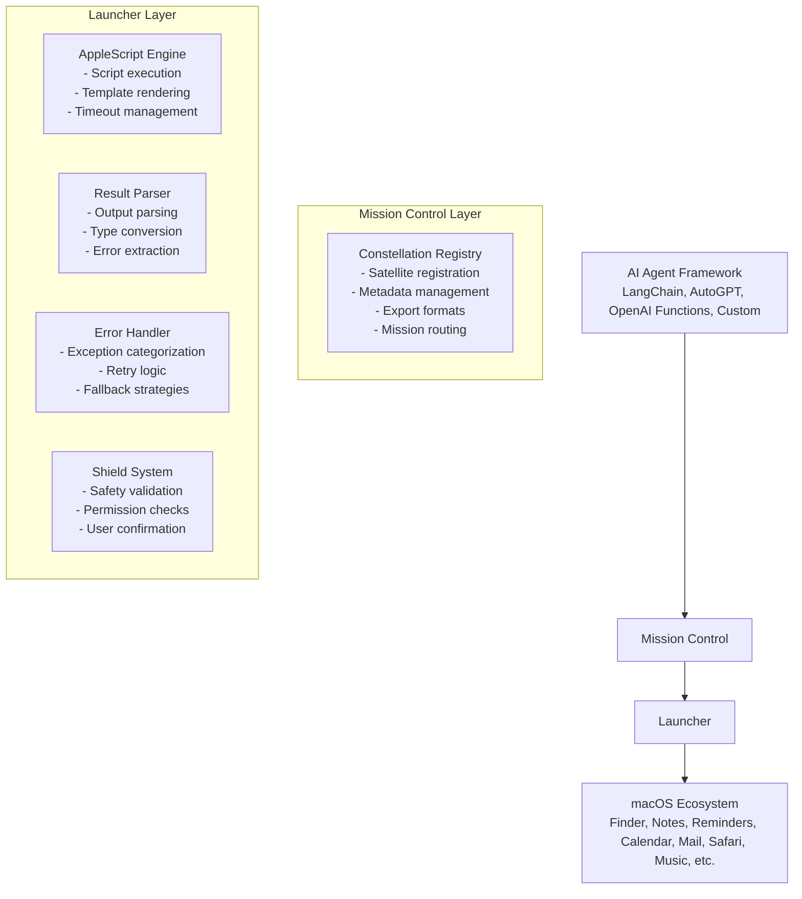

# Orbit Design Document

> **Version:** 1.0
> **Last Updated:** 2026-01-27
> **Status:** Design Phase

---

## 📋 Table of Contents

1. [Project Overview](#project-overview)
2. [Mission Statement](#mission-statement)
3. [Core Architecture](#core-architecture)
4. [Satellite Design](#satellite-design)
5. [Mission Control System](#mission-control-system)
6. [Shield System](#shield-system)
7. [Project Structure](#project-structure)
8. [Technical Specifications](#technical-specifications)
9. [Development Roadmap](#development-roadmap)
10. [Testing Strategy](#testing-strategy)

---

## Project Overview

### Mission

Build a universal, standardized macOS automation toolkit that enables any LLM/Agent framework (LangChain, AutoGPT, OpenAI Functions, etc.) to seamlessly interact with macOS through AppleScript.

### Core Values

- **Framework Agnostic**: Any Agent/LLM can integrate without modification
- **Standardized Interface**: Unified function calling conventions
- **Safety First**: Built-in permission management and security checks
- **Highly Extensible**: Add new satellites without modifying core code
- **Developer Experience**: Clean, intuitive API with excellent documentation

---

## Mission Statement

> *"Orbit puts macOS automation in orbit - providing AI agents with standardized, safe, and extensible tools to control the Mac ecosystem."*

---

## Core Architecture

### High-Level Design



### Design Principles

1. **Separation of Concerns**: Each layer has a single, well-defined responsibility
2. **Extensibility**: New satellites can be added without modifying core code
3. **Safety by Default**: All operations pass through the shield system
4. **Framework Independence**: Core logic is decoupled from any specific AI framework
5. **Type Safety**: Full type hints for better IDE support and runtime validation

---

## Satellite Design

### Satellite Data Structure

```python
from dataclasses import dataclass, field
from typing import Any, Dict, Optional, Callable
from enum import Enum

class SafetyLevel(Enum):
    """Satellite safety classification"""
    SAFE = "safe"                  # Read-only, no side effects
    MODERATE = "moderate"          # Create/modify operations
    DANGEROUS = "dangerous"        # Delete operations
    CRITICAL = "critical"          # System-level operations

@dataclass
class SatelliteParameter:
    """Parameter definition for a satellite"""
    name: str
    type: str  # "string", "integer", "boolean", "object", "array"
    description: str
    required: bool = True
    default: Any = None
    enum: Optional[list] = None

@dataclass
class Satellite:
    """Base satellite (tool) class"""
    name: str                              # Unique identifier
    description: str                       # LLM-readable description
    category: str                          # Category: "system", "files", "notes", etc.
    parameters: list[SatelliteParameter]   # Parameter list
    safety_level: SafetyLevel              # Safety classification
    applescript_template: str              # AppleScript template
    result_parser: Optional[Callable] = None  # Result parser function
    examples: list[dict] = field(default_factory=list)  # Usage examples
    version: str = "1.0.0"                 # Satellite version
    author: str = ""                       # Satellite author

    def to_openai_function(self) -> dict:
        """Export to OpenAI Function Calling format"""
        properties = {
            param.name: {
                "type": param.type,
                "description": param.description
            }
            for param in self.parameters
        }

        for param in self.parameters:
            if param.default is not None:
                properties[param.name]["default"] = param.default
            if param.enum:
                properties[param.name]["enum"] = param.enum

        return {
            "type": "function",
            "function": {
                "name": self.name,
                "description": self.description,
                "parameters": {
                    "type": "object",
                    "properties": properties,
                    "required": [p.name for p in self.parameters if p.required]
                }
            }
        }

    def to_dict(self) -> dict:
        """Export to dictionary format"""
        return {
            "name": self.name,
            "description": self.description,
            "category": self.category,
            "safety_level": self.safety_level.value,
            "version": self.version,
            "parameters": [
                {
                    "name": p.name,
                    "type": p.type,
                    "description": p.description,
                    "required": p.required,
                    "default": p.default
                }
                for p in self.parameters
            ],
            "examples": self.examples
        }
```

### Result Parser System

```python
from abc import ABC, abstractmethod
import json
import re

class ResultParser(ABC):
    """Base result parser"""

    @abstractmethod
    def parse(self, raw_output: str) -> Any:
        """Parse raw AppleScript output"""
        pass

class JSONResultParser(ResultParser):
    """Parse JSON output"""

    def parse(self, raw_output: str) -> dict:
        try:
            return json.loads(raw_output)
        except json.JSONDecodeError:
            raise ValueError(f"Failed to parse JSON: {raw_output}")

class DelimitedResultParser(ResultParser):
    """Parse delimited output (e.g., 'value1|value2|value3')"""

    def __init__(self, delimiter: str = "|", field_names: list[str] = None):
        self.delimiter = delimiter
        self.field_names = field_names

    def parse(self, raw_output: str) -> dict | list:
        parts = raw_output.split(self.delimiter)
        if self.field_names:
            return dict(zip(self.field_names, parts))
        return parts

class RegexResultParser(ResultParser):
    """Parse output using regex patterns"""

    def __init__(self, pattern: str, group_names: list[str] = None):
        self.pattern = re.compile(pattern)
        self.group_names = group_names

    def parse(self, raw_output: str) -> dict | list:
        match = self.pattern.search(raw_output)
        if not match:
            raise ValueError(f"Regex pattern did not match: {raw_output}")

        groups = match.groups()
        if self.group_names:
            return dict(zip(self.group_names, groups))
        return groups

class BooleanResultParser(ResultParser):
    """Parse boolean output"""

    def parse(self, raw_output: str) -> bool:
        return raw_output.strip().lower() in ("true", "yes", "1")
```

---

## Mission Control System

### Constellation Registry

```python
from typing import Dict, List, Optional
import json

class Constellation:
    """Satellite registry - manages the constellation of tools"""

    def __init__(self):
        self._satellites: Dict[str, Satellite] = {}
        self._categories: Dict[str, List[str]] = {}

    def register(self, satellite: Satellite) -> None:
        """Register a satellite"""
        if satellite.name in self._satellites:
            raise ValueError(f"Satellite '{satellite.name}' already registered")

        self._satellites[satellite.name] = satellite

        # Update category index
        if satellite.category not in self._categories:
            self._categories[satellite.category] = []
        self._categories[satellite.category].append(satellite.name)

    def unregister(self, name: str) -> None:
        """Unregister a satellite"""
        if name not in self._satellites:
            raise ValueError(f"Satellite '{name}' not found")

        satellite = self._satellites[name]
        self._categories[satellite.category].remove(name)
        del self._satellites[name]

    def get(self, name: str) -> Optional[Satellite]:
        """Get satellite by name"""
        return self._satellites.get(name)

    def list_all(self) -> List[Satellite]:
        """List all satellites"""
        return list(self._satellites.values())

    def list_by_category(self, category: str) -> List[Satellite]:
        """List satellites by category"""
        satellite_names = self._categories.get(category, [])
        return [self._satellites[name] for name in satellite_names]

    def list_by_safety(self, safety_level: SafetyLevel) -> List[Satellite]:
        """List satellites by safety level"""
        return [
            s for s in self._satellites.values()
            if s.safety_level == safety_level
        ]

    def search(self, query: str) -> List[Satellite]:
        """Search satellites by name or description"""
        query = query.lower()
        return [
            s for s in self._satellites.values()
            if query in s.name.lower() or query in s.description.lower()
        ]

    def to_openai_functions(self) -> List[dict]:
        """Export to OpenAI Functions format"""
        return [satellite.to_openai_function() for satellite in self._satellites.values()]

    def to_json_schema(self) -> str:
        """Export to JSON Schema"""
        return json.dumps(
            [satellite.to_dict() for satellite in self._satellites.values()],
            indent=2,
            ensure_ascii=False
        )

    def get_categories(self) -> List[str]:
        """Get all categories"""
        return list(self._categories.keys())

    def get_stats(self) -> dict:
        """Get constellation statistics"""
        return {
            "total_satellites": len(self._satellites),
            "categories": len(self._categories),
            "by_safety": {
                level.value: len(self.list_by_safety(level))
                for level in SafetyLevel
            }
        }
```

### Mission Launcher

```python
import subprocess
from typing import Optional, Any
from jinja2 import Template

class Launcher:
    """Mission launcher - executes AppleScript for satellites"""

    def __init__(
        self,
        safety_shield: Optional['SafetyShield'] = None,
        timeout: int = 30,
        retry_on_failure: bool = False,
        max_retries: int = 3
    ):
        self.safety_shield = safety_shield
        self.timeout = timeout
        self.retry_on_failure = retry_on_failure
        self.max_retries = max_retries

    def launch(
        self,
        satellite: Satellite,
        parameters: dict,
        bypass_shield: bool = False
    ) -> Any:
        """Launch a mission (execute a satellite)

        Args:
            satellite: The satellite to launch
            parameters: Mission parameters
            bypass_shield: Skip safety checks (not recommended)

        Returns:
            Mission result
        """
        # Safety check
        if not bypass_shield and self.safety_shield:
            self.safety_shield.validate(satellite, parameters)

        # Render AppleScript template
        script = self._render_template(satellite.applescript_template, parameters)

        # Execute with retry logic
        for attempt in range(self.max_retries):
            try:
                result = self._execute_applescript(script)
                break
            except Exception as e:
                if attempt == self.max_retries - 1:
                    raise
                if not self.retry_on_failure:
                    raise

        # Parse result
        if satellite.result_parser:
            return satellite.result_parser.parse(result)
        return result

    def _render_template(self, template: str, parameters: dict) -> str:
        """Render AppleScript template using Jinja2"""
        try:
            jinja_template = Template(template)
            return jinja_template.render(**parameters)
        except Exception as e:
            raise ValueError(f"Template rendering failed: {e}")

    def _execute_applescript(self, script: str) -> str:
        """Execute AppleScript via osascript"""
        try:
            result = subprocess.run(
                ["osascript", "-e", script],
                capture_output=True,
                text=True,
                timeout=self.timeout
            )

            if result.returncode != 0:
                raise AppleScriptError(
                    f"AppleScript execution failed: {result.stderr.strip()}",
                    script=script,
                    return_code=result.returncode
                )

            return result.stdout.strip()

        except subprocess.TimeoutExpired:
            raise AppleScriptError(f"Script execution timed out after {self.timeout}s")
        except Exception as e:
            raise AppleScriptError(f"Unexpected error: {str(e)}")

    async def launch_async(self, satellite: Satellite, parameters: dict) -> Any:
        """Launch a mission asynchronously"""
        import asyncio
        return await asyncio.to_thread(self.launch, satellite, parameters)
```

---

## Shield System

### Safety Architecture

```python
from typing import Dict, List, Optional, Callable
from pathlib import Path
from enum import Enum

class ShieldAction(Enum):
    """Shield action after safety check"""
    ALLOW = "allow"
    DENY = "deny"
    REQUIRE_CONFIRMATION = "require_confirmation"

class SafetyShield:
    """Safety shield - validates and controls mission execution"""

    # Default shield rules
    DEFAULT_RULES = {
        SafetyLevel.SAFE: ShieldAction.ALLOW,
        SafetyLevel.MODERATE: ShieldAction.REQUIRE_CONFIRMATION,
        SafetyLevel.DANGEROUS: ShieldAction.REQUIRE_CONFIRMATION,
        SafetyLevel.CRITICAL: ShieldAction.DENY,
    }

    # Protected paths (dangerous to modify)
    PROTECTED_PATHS = [
        Path("/"),
        Path("/System"),
        Path("/Library"),
        Path("/usr"),
        Path("/bin"),
        Path("/sbin"),
    ]

    # Dangerous command patterns
    DANGEROUS_COMMANDS = [
        "rm -rf /",
        "dd if=/dev/zero",
        ":(){ :|:& };:",  # fork bomb
        "mkfs",
        "chmod 000",
        "chown root",
    ]

    def __init__(
        self,
        rules: Optional[Dict[SafetyLevel, ShieldAction]] = None,
        confirmation_callback: Optional[Callable[[Satellite, dict], bool]] = None,
        protected_paths: Optional[List[Path]] = None,
        dangerous_commands: Optional[List[str]] = None
    ):
        self.rules = rules or self.DEFAULT_RULES
        self.confirmation_callback = confirmation_callback
        self.protected_paths = protected_paths or self.PROTECTED_PATHS
        self.dangerous_commands = dangerous_commands or self.DANGEROUS_COMMANDS

    def validate(self, satellite: Satellite, parameters: dict) -> bool:
        """Validate mission safety

        Returns:
            True if safe, raises ShieldError otherwise
        """
        action = self.rules.get(satellite.safety_level, ShieldAction.DENY)

        # Check protected paths
        if "path" in parameters:
            self._check_path(parameters["path"])

        # Check dangerous commands
        if "command" in parameters:
            self._check_command(parameters["command"])

        # Apply shield action
        if action == ShieldAction.DENY:
            raise ShieldError(
                f"Satellite '{satellite.name}' blocked due to {satellite.safety_level.value} safety level"
            )

        elif action == ShieldAction.REQUIRE_CONFIRMATION:
            if self.confirmation_callback:
                if not self.confirmation_callback(satellite, parameters):
                    raise ShieldError("User denied the mission")
            else:
                raise ShieldError(
                    f"Satellite '{satellite.name}' requires confirmation but no callback provided"
                )

        return True

    def _check_path(self, path: str) -> None:
        """Check if path is protected"""
        resolved_path = Path(path).expanduser().resolve()

        for protected in self.protected_paths:
            try:
                if resolved_path.is_relative_to(protected):
                    raise ShieldError(f"Protected path detected: {path}")
            except ValueError:
                # Different drives on Windows, not applicable for macOS
                pass

    def _check_command(self, command: str) -> None:
        """Check if command is dangerous"""
        for dangerous in self.dangerous_commands:
            if dangerous in command:
                raise ShieldError(f"Dangerous command detected: {command}")

    def add_protected_path(self, path: str) -> None:
        """Add a protected path"""
        self.protected_paths.append(Path(path).expanduser().resolve())

    def remove_protected_path(self, path: str) -> None:
        """Remove a protected path"""
        path_obj = Path(path).expanduser().resolve()
        if path_obj in self.protected_paths:
            self.protected_paths.remove(path_obj)
```

### Exception Hierarchy

```python
class OrbitError(Exception):
    """Base Orbit exception"""
    pass

class ShieldError(OrbitError):
    """Shield safety check failed"""
    pass

class AppleScriptError(OrbitError):
    """AppleScript execution error"""
    def __init__(self, message: str, script: str = None, return_code: int = None):
        super().__init__(message)
        self.script = script
        self.return_code = return_code

class AppleScriptTimeoutError(AppleScriptError):
    """AppleScript execution timed out"""
    pass

class AppleScriptPermissionError(AppleScriptError):
    """AppleScript insufficient permissions"""
    pass

class AppleScriptSyntaxError(AppleScriptError):
    """AppleScript syntax error (template issue)"""
    pass

class SatelliteNotFoundError(OrbitError):
    """Satellite not found in constellation"""
    pass

class ParameterValidationError(OrbitError):
    """Parameter validation failed"""
    pass

class TemplateRenderingError(OrbitError):
    """Template rendering failed"""
    pass
```

---

## Project Structure

### Directory Layout

```
orbit/
├── src/
│   └── orbit/
│       ├── __init__.py
│       ├── core/
│       │   ├── __init__.py
│       │   ├── satellite.py          # Satellite base class
│       │   ├── constellation.py      # Constellation registry
│       │   ├── launcher.py           # Mission launcher
│       │   ├── shield.py             # Safety shield
│       │   └── exceptions.py         # Exception definitions
│       ├── satellites/
│       │   ├── __init__.py
│       │   ├── system/               # System telemetry satellites
│       │   │   ├── __init__.py
│       │   │   ├── info.py
│       │   │   ├── clipboard.py
│       │   │   ├── notification.py
│       │   │   ├── screenshot.py
│       │   │   ├── volume.py
│       │   │   └── brightness.py
│       │   ├── files/                # File communication satellites
│       │   │   ├── __init__.py
│       │   │   ├── list.py
│       │   │   ├── read.py
│       │   │   ├── write.py
│       │   │   ├── delete.py
│       │   │   ├── move.py
│       │   │   ├── copy.py
│       │   │   ├── search.py
│       │   │   └── trash.py
│       │   ├── apps/                 # App station satellites
│       │   │   ├── notes/
│       │   │   │   ├── __init__.py
│       │   │   │   ├── list.py
│       │   │   │   ├── get.py
│       │   │   │   ├── create.py
│       │   │   │   ├── update.py
│       │   │   │   ├── delete.py
│       │   │   │   └── search.py
│       │   │   ├── reminders/
│       │   │   │   ├── __init__.py
│       │   │   │   ├── list.py
│       │   │   │   ├── create.py
│       │   │   │   ├── complete.py
│       │   │   │   └── delete.py
│       │   │   ├── calendar/
│       │   │   │   ├── __init__.py
│       │   │   │   ├── list_calendars.py
│       │   │   │   ├── get_events.py
│       │   │   │   ├── create_event.py
│       │   │   │   └── delete_event.py
│       │   │   ├── mail/
│       │   │   │   ├── __init__.py
│       │   │   │   ├── send.py
│       │   │   │   ├── list_inbox.py
│       │   │   │   └── get.py
│       │   │   ├── safari/
│       │   │   │   ├── __init__.py
│       │   │   │   ├── open.py
│       │   │   │   ├── get_url.py
│       │   │   │   ├── get_text.py
│       │   │   │   └── list_tabs.py
│       │   │   └── music/
│       │   │       ├── __init__.py
│       │   │       ├── play.py
│       │   │       ├── pause.py
│       │   │       ├── next.py
│       │   │       ├── previous.py
│       │   │       └── play_track.py
│       │   ├── finder/               # Finder satellites
│       │   │   ├── __init__.py
│       │   │   ├── open_folder.py
│       │   │   ├── new_folder.py
│       │   │   └── reveal.py
│       │   ├── contacts/             # Contacts satellites
│       │   │   ├── __init__.py
│       │   │   ├── search.py
│       │   │   └── get.py
│       │   ├── wifi/                 # WiFi satellites
│       │   │   ├── __init__.py
│       │   │   ├── connect.py
│       │   │   ├── disconnect.py
│       │   │   ├── list.py
│       │   │   └── current.py
│       │   └── apps/                 # App control satellites
│       │       ├── __init__.py
│       │       ├── list.py
│       │       ├── launch.py
│       │       ├── quit.py
│       │       └── activate.py
│       └── parsers/
│           ├── __init__.py
│           ├── json.py
│           ├── delimited.py
│           ├── regex.py
│           └── boolean.py
├── tests/
│   ├── __init__.py
│   ├── core/
│   │   ├── test_satellite.py
│   │   ├── test_constellation.py
│   │   ├── test_launcher.py
│   │   └── test_shield.py
│   ├── satellites/
│   │   ├── test_system.py
│   │   ├── test_files.py
│   │   └── test_apps.py
│   └── integration/
│       └── test_mission_control.py
├── examples/
│   ├── basic_usage.py
│   ├── openai_functions.py
│   ├── langchain_agent.py
│   ├── custom_agent.py
│   └── async_examples.py
├── docs/
│   ├── README_ORBIT.md          # Main README
│   ├── DESIGN.md                # This document
│   ├── QUICKSTART.md            # Quick start guide
│   ├── API_REFERENCE.md         # Complete API docs
│   ├── SATELLITES.md            # Complete satellite list
│   ├── SECURITY.md              # Security model
│   ├── BRAND.md                 # Brand guidelines
│   ├── CONTRIBUTING.md          # Contributing guide
│   └── TROUBLESHOOTING.md       # Troubleshooting
├── pyproject.toml
├── LICENSE
└── README.md                    # Symlink to README_ORBIT.md
```

---

## Technical Specifications

### Technology Stack

| Component | Technology | Version |
|-----------|-----------|---------|
| Python | | >= 3.10 |
| Package Manager | Poetry | latest |
| Type Checking | mypy | latest |
| Testing | pytest | latest |
| Test Coverage | pytest-cov | latest |
| Documentation | Sphinx + mkdocs | latest |
| Code Formatting | black | latest |
| Linting | ruff | latest |
| Template Engine | Jinja2 | latest |
| Async Runtime | asyncio | built-in |
| Logging | structlog | latest |

### Dependencies

```toml
[tool.poetry.dependencies]
python = "^3.10"
jinja2 = "^3.1.0"
structlog = "^23.0.0"
pydantic = "^2.0.0"

[tool.poetry.group.dev.dependencies]
pytest = "^7.4.0"
pytest-cov = "^4.1.0"
pytest-asyncio = "^0.21.0"
mypy = "^1.5.0"
black = "^23.7.0"
ruff = "^0.0.280"
sphinx = "^7.1.0"
mkdocs = "^1.5.0"
```

### Code Quality Standards

```toml
[tool.black]
line-length = 100
target-version = ['py310']

[tool.ruff]
line-length = 100
select = ["E", "F", "I", "N", "W"]
ignore = ["E501"]

[tool.mypy]
python_version = "3.10"
warn_return_any = true
warn_unused_configs = true
disallow_untyped_defs = true
```

---

## Development Roadmap

### Phase 1: Core Framework (Week 1-2)
**Deliverables:**
- [x] Architecture design
- [ ] Satellite base class implementation
- [ ] Constellation registry implementation
- [ ] Mission launcher implementation
- [ ] Safety shield implementation
- [ ] Exception hierarchy
- [ ] Basic unit tests
- [ ] Documentation setup

### Phase 2: System Telemetry (Week 3)
**Deliverables:**
- [ ] System info satellite
- [ ] Clipboard satellites (get/set)
- [ ] Notification satellite
- [ ] Screenshot satellite
- [ ] Volume control satellites
- [ ] Brightness control satellites
- [ ] Unit tests for all system satellites

### Phase 3: File Communications (Week 4)
**Deliverables:**
- [ ] File list satellite
- [ ] File read/write satellites
- [ ] File delete satellite
- [ ] File move/copy satellites
- [ ] File search satellite
- [ ] Trash operations
- [ ] Unit tests for all file satellites

### Phase 4: App Stations - Part 1 (Week 5)
**Deliverables:**
- [ ] Notes satellites (list, get, create, update, delete, search)
- [ ] Reminders satellites (list, create, complete, delete)
- [ ] Calendar satellites (list, get events, create, delete)
- [ ] Unit tests for all satellites

### Phase 5: App Stations - Part 2 (Week 6)
**Deliverables:**
- [ ] Mail satellites (send, list inbox, get, delete)
- [ ] Safari satellites (open, get URL, get text, list tabs, search)
- [ ] Music satellites (play, pause, next, previous, play track, get current)
- [ ] Unit tests for all satellites

### Phase 6: Advanced Satellites (Week 7-8)
**Deliverables:**
- [ ] Finder satellites (open folder, new folder, reveal, get selection)
- [ ] App control satellites (list, launch, quit, activate)
- [ ] Contacts satellites (search, get)
- [ ] WiFi satellites (connect, disconnect, list, current)
- [ ] Unit tests for all satellites

### Phase 7: Framework Integration (Week 9)
**Deliverables:**
- [ ] OpenAI Functions integration example
- [ ] LangChain integration example
- [ ] AutoGen integration example
- [ ] Custom agent example
- [ ] Async usage examples

### Phase 8: Documentation & Release (Week 10)
**Deliverables:**
- [ ] Complete API documentation
- [ ] Quick start guide
- [ ] Contributing guide
- [ ] Troubleshooting guide
- [ ] Brand guidelines
- [ ] Integration tutorials
- [ ] v1.0.0 release

---

## Testing Strategy

### Unit Testing

```python
# tests/core/test_satellite.py
import pytest
from orbit.core.satellite import Satellite, SatelliteParameter, SafetyLevel

def test_satellite_creation():
    satellite = Satellite(
        name="test_satellite",
        description="Test satellite",
        category="test",
        parameters=[],
        safety_level=SafetyLevel.SAFE,
        applescript_template='return "test"'
    )

    assert satellite.name == "test_satellite"
    assert satellite.safety_level == SafetyLevel.SAFE

def test_satellite_to_openai_function():
    satellite = Satellite(
        name="test_satellite",
        description="Test satellite",
        category="test",
        parameters=[
            SatelliteParameter(
                name="param1",
                type="string",
                description="Test parameter",
                required=True
            )
        ],
        safety_level=SafetyLevel.SAFE,
        applescript_template='return "{{ param1 }}"'
    )

    openai_func = satellite.to_openai_function()

    assert openai_func["type"] == "function"
    assert openai_func["function"]["name"] == "test_satellite"
    assert "param1" in openai_func["function"]["parameters"]["properties"]
```

### Integration Testing

```python
# tests/integration/test_mission_control.py
import pytest
from orbit import MissionControl
from orbit.satellites import all_satellites

@pytest.mark.integration
def test_full_mission_cycle():
    """Test complete mission cycle from registration to execution"""
    mission = MissionControl()
    mission.register_constellation(all_satellites)

    # Test system info satellite
    result = mission.launch("system_get_info", {})

    assert "version" in result
    assert "hostname" in result
    assert "username" in result
```

### Safety Testing

```python
# tests/core/test_shield.py
import pytest
from orbit.core.shield import SafetyShield, ShieldError
from orbit.core.satellite import Satellite, SafetyLevel

def test_protected_path_blocking():
    shield = SafetyShield()

    dangerous_satellite = Satellite(
        name="delete_system",
        description="Delete system files",
        category="files",
        parameters=[],
        safety_level=SafetyLevel.CRITICAL,
        applescript_template=""
    )

    with pytest.raises(ShieldError):
        shield.validate(dangerous_satellite, {"path": "/System"})
```

### Cross-Version Testing

Test on multiple macOS versions:
- macOS Monterey (12.x)
- macOS Ventura (13.x)
- macOS Sonoma (14.x)
- macOS Sequoia (15.x)

---

## Appendices

### A. Naming Conventions

- **Package**: `orbit` (import: `from orbit import ...`)
- **Tools**: "Satellites"
- **Registry**: "Constellation"
- **Runner**: "Launcher"
- **Safety**: "Shield"
- **Parameters**: "Coordinates"
- **Execution**: "Mission"

### B. Color Palette

```css
/* Orbit Colors */
--deep-space-blue: #1E3A5F;    /* Primary branding */
--orbit-cyan: #00D4FF;          /* Accents & highlights */
--satellite-silver: #E8E8E8;    /* Secondary text */
--void-black: #0D1117;          /* Background */
--star-white: #FFFFFF;          /* Primary text */
```

### C. Satellite Categories

1. **System Telemetry** - System-level operations
2. **File Communications** - File system operations
3. **App Stations** - Application-specific operations
   - Notes
   - Reminders
   - Calendar
   - Mail
   - Safari
   - Music
   - Contacts
4. **Finder** - Finder operations
5. **Network** - Network operations
6. **Application Control** - App lifecycle management

---

**Document Version:** 1.0
**Last Updated:** 2026-01-27
**Status:** Ready for Implementation
