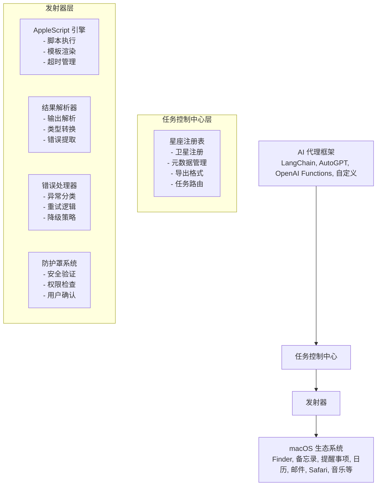

# Orbit 设计文档

> **版本：** 1.0
> **最后更新：** 2026-01-27
> **状态：** 设计阶段

---

## 📋 目录

1. [项目概述](#项目概述)
2. [使命宣言](#使命宣言)
3. [核心架构](#核心架构)
4. [卫星设计](#卫星设计)
5. [任务控制系统](#任务控制系统)
6. [防护罩系统](#防护罩系统)
7. [项目结构](#项目结构)
8. [技术规范](#技术规范)
9. [开发路线图](#开发路线图)
10. [测试策略](#测试策略)

---

## 项目概述

### 使命

构建一个通用的、标准化的 macOS 自动化工具包，使任何 LLM/代理框架（LangChain、AutoGPT、OpenAI Functions 等）都能通过 AppleScript 无缝地与 macOS 交互。

### 核心价值观

- **框架无关** - 任何代理/LLM 都可以无缝集成
- **标准化接口** - 统一的函数调用规范
- **安全优先** - 内置权限管理和安全检查
- **高度可扩展** - 无需修改核心代码即可添加新卫星
- **开发者体验** - 清晰直观的 API 和优秀的文档

---

## 使命宣言

> *"Orbit 让 macOS 自动化进入轨道 - 为 AI 代理提供标准化、安全且可扩展的工具来控制 Mac 生态系统。"*

---

## 核心架构

### 高层设计



### 设计原则

1. **关注点分离** - 每层都有单一、明确定义的职责
2. **可扩展性** - 无需修改核心代码即可添加新卫星
3. **默认安全** - 所有操作都通过防护罩系统
4. **框架独立** - 核心逻辑与任何特定 AI 框架解耦
5. **类型安全** - 完整的类型提示以获得更好的 IDE 支持和运行时验证

---

## 卫星设计

### 卫星数据结构

```python
from dataclasses import dataclass, field
from typing import Any, Dict, Optional, Callable
from enum import Enum

class SafetyLevel(Enum):
    """卫星安全分类"""
    SAFE = "safe"                  # 只读，无副作用
    MODERATE = "moderate"          # 创建/修改操作
    DANGEROUS = "dangerous"        # 删除操作
    CRITICAL = "critical"          # 系统级操作

@dataclass
class SatelliteParameter:
    """卫星参数定义"""
    name: str
    type: str  # "string", "integer", "boolean", "object", "array"
    description: str
    required: bool = True
    default: Any = None
    enum: Optional[list] = None

@dataclass
class Satellite:
    """卫星（工具）基类"""
    name: str                              # 唯一标识符
    description: str                       # LLM 可读的描述
    category: str                          # 类别："system", "files", "notes" 等
    parameters: list[SatelliteParameter]   # 参数列表
    safety_level: SafetyLevel              # 安全分类
    applescript_template: str              # AppleScript 模板
    result_parser: Optional[Callable] = None  # 结果解析函数
    examples: list[dict] = field(default_factory=list)  # 使用示例
    version: str = "1.0.0"                 # 卫星版本
    author: str = ""                       # 卫星作者

    def to_openai_function(self) -> dict:
        """导出为 OpenAI Function Calling 格式"""
        properties = {
            param.name: {
                "type": param.type,
                "description": param.description
            }
            for param in self.parameters
        }

        for param in self.parameters:
            if param.default is not None:
                properties[param.name]["default"] = param.default
            if param.enum:
                properties[param.name]["enum"] = param.enum

        return {
            "type": "function",
            "function": {
                "name": self.name,
                "description": self.description,
                "parameters": {
                    "type": "object",
                    "properties": properties,
                    "required": [p.name for p in self.parameters if p.required]
                }
            }
        }

    def to_dict(self) -> dict:
        """导出为字典格式"""
        return {
            "name": self.name,
            "description": self.description,
            "category": self.category,
            "safety_level": self.safety_level.value,
            "version": self.version,
            "parameters": [
                {
                    "name": p.name,
                    "type": p.type,
                    "description": p.description,
                    "required": p.required,
                    "default": p.default
                }
                for p in self.parameters
            ],
            "examples": self.examples
        }
```

### 结果解析器系统

```python
from abc import ABC, abstractmethod
import json
import re

class ResultParser(ABC):
    """基础结果解析器"""

    @abstractmethod
    def parse(self, raw_output: str) -> Any:
        """解析原始 AppleScript 输出"""
        pass

class JSONResultParser(ResultParser):
    """解析 JSON 输出"""

    def parse(self, raw_output: str) -> dict:
        try:
            return json.loads(raw_output)
        except json.JSONDecodeError:
            raise ValueError(f"JSON 解析失败：{raw_output}")

class DelimitedResultParser(ResultParser):
    """解析分隔符输出（例如 'value1|value2|value3'）"""

    def __init__(self, delimiter: str = "|", field_names: list[str] = None):
        self.delimiter = delimiter
        self.field_names = field_names

    def parse(self, raw_output: str) -> dict | list:
        parts = raw_output.split(self.delimiter)
        if self.field_names:
            return dict(zip(self.field_names, parts))
        return parts

class RegexResultParser(ResultParser):
    """使用正则表达式解析输出"""

    def __init__(self, pattern: str, group_names: list[str] = None):
        self.pattern = re.compile(pattern)
        self.group_names = group_names

    def parse(self, raw_output: str) -> dict | list:
        match = self.pattern.search(raw_output)
        if not match:
            raise ValueError(f"正则表达式未匹配：{raw_output}")

        groups = match.groups()
        if self.group_names:
            return dict(zip(self.group_names, groups))
        return groups

class BooleanResultParser(ResultParser):
    """解析布尔值输出"""

    def parse(self, raw_output: str) -> bool:
        return raw_output.strip().lower() in ("true", "yes", "1")
```

---

## 任务控制系统

### 星座注册表

```python
from typing import Dict, List, Optional
import json

class Constellation:
    """卫星注册表 - 管理工具星座"""

    def __init__(self):
        self._satellites: Dict[str, Satellite] = {}
        self._categories: Dict[str, List[str]] = {}

    def register(self, satellite: Satellite) -> None:
        """注册卫星"""
        if satellite.name in self._satellites:
            raise ValueError(f"卫星 '{satellite.name}' 已注册")

        self._satellites[satellite.name] = satellite

        # 更新类别索引
        if satellite.category not in self._categories:
            self._categories[satellite.category] = []
        self._categories[satellite.category].append(satellite.name)

    def unregister(self, name: str) -> None:
        """注销卫星"""
        if name not in self._satellites:
            raise ValueError(f"卫星 '{name}' 未找到")

        satellite = self._satellites[name]
        self._categories[satellite.category].remove(name)
        del self._satellites[name]

    def get(self, name: str) -> Optional[Satellite]:
        """按名称获取卫星"""
        return self._satellites.get(name)

    def list_all(self) -> List[Satellite]:
        """列出所有卫星"""
        return list(self._satellites.values())

    def list_by_category(self, category: str) -> List[Satellite]:
        """按类别列出卫星"""
        satellite_names = self._categories.get(category, [])
        return [self._satellites[name] for name in satellite_names]

    def list_by_safety(self, safety_level: SafetyLevel) -> List[Satellite]:
        """按安全等级列出卫星"""
        return [
            s for s in self._satellites.values()
            if s.safety_level == safety_level
        ]

    def search(self, query: str) -> List[Satellite]:
        """按名称或描述搜索卫星"""
        query = query.lower()
        return [
            s for s in self._satellites.values()
            if query in s.name.lower() or query in s.description.lower()
        ]

    def to_openai_functions(self) -> List[dict]:
        """导出为 OpenAI Functions 格式"""
        return [satellite.to_openai_function() for satellite in self._satellites.values()]

    def to_json_schema(self) -> str:
        """导出为 JSON Schema"""
        return json.dumps(
            [satellite.to_dict() for satellite in self._satellites.values()],
            indent=2,
            ensure_ascii=False
        )

    def get_categories(self) -> List[str]:
        """获取所有类别"""
        return list(self._categories.keys())

    def get_stats(self) -> dict:
        """获取星座统计信息"""
        return {
            "total_satellites": len(self._satellites),
            "categories": len(self._categories),
            "by_safety": {
                level.value: len(self.list_by_safety(level))
                for level in SafetyLevel
            }
        }
```

### 任务发射器

```python
import subprocess
from typing import Optional, Any
from jinja2 import Template

class Launcher:
    """任务发射器 - 为卫星执行 AppleScript"""

    def __init__(
        self,
        safety_shield: Optional['SafetyShield'] = None,
        timeout: int = 30,
        retry_on_failure: bool = False,
        max_retries: int = 3
    ):
        self.safety_shield = safety_shield
        self.timeout = timeout
        self.retry_on_failure = retry_on_failure
        self.max_retries = max_retries

    def launch(
        self,
        satellite: Satellite,
        parameters: dict,
        bypass_shield: bool = False
    ) -> Any:
        """发射任务（执行卫星）

        Args:
            satellite: 要发射的卫星
            parameters: 任务参数
            bypass_shield: 跳过安全检查（不推荐）

        Returns:
            任务结果
        """
        # 安全检查
        if not bypass_shield and self.safety_shield:
            self.safety_shield.validate(satellite, parameters)

        # 渲染 AppleScript 模板
        script = self._render_template(satellite.applescript_template, parameters)

        # 使用重试逻辑执行
        for attempt in range(self.max_retries):
            try:
                result = self._execute_applescript(script)
                break
            except Exception as e:
                if attempt == self.max_retries - 1:
                    raise
                if not self.retry_on_failure:
                    raise

        # 解析结果
        if satellite.result_parser:
            return satellite.result_parser.parse(result)
        return result

    def _render_template(self, template: str, parameters: dict) -> str:
        """使用 Jinja2 渲染 AppleScript 模板"""
        try:
            jinja_template = Template(template)
            return jinja_template.render(**parameters)
        except Exception as e:
            raise ValueError(f"模板渲染失败：{e}")

    def _execute_applescript(self, script: str) -> str:
        """通过 osascript 执行 AppleScript"""
        try:
            result = subprocess.run(
                ["osascript", "-e", script],
                capture_output=True,
                text=True,
                timeout=self.timeout
            )

            if result.returncode != 0:
                raise AppleScriptError(
                    f"AppleScript 执行失败：{result.stderr.strip()}",
                    script=script,
                    return_code=result.returncode
                )

            return result.stdout.strip()

        except subprocess.TimeoutExpired:
            raise AppleScriptError(f"脚本执行在 {self.timeout}s 后超时")
        except Exception as e:
            raise AppleScriptError(f"意外错误：{str(e)}")

    async def launch_async(self, satellite: Satellite, parameters: dict) -> Any:
        """异步发射任务"""
        import asyncio
        return await asyncio.to_thread(self.launch, satellite, parameters)
```

---

## 防护罩系统

### 安全架构

```python
from typing import Dict, List, Optional, Callable
from pathlib import Path
from enum import Enum

class ShieldAction(Enum):
    """安全检查后的防护动作"""
    ALLOW = "allow"
    DENY = "deny"
    REQUIRE_CONFIRMATION = "require_confirmation"

class SafetyShield:
    """安全防护罩 - 验证和控制任务执行"""

    # 默认防护规则
    DEFAULT_RULES = {
        SafetyLevel.SAFE: ShieldAction.ALLOW,
        SafetyLevel.MODERATE: ShieldAction.REQUIRE_CONFIRMATION,
        SafetyLevel.DANGEROUS: ShieldAction.REQUIRE_CONFIRMATION,
        SafetyLevel.CRITICAL: ShieldAction.DENY,
    }

    # 受保护路径（修改危险）
    PROTECTED_PATHS = [
        Path("/"),
        Path("/System"),
        Path("/Library"),
        Path("/usr"),
        Path("/bin"),
        Path("/sbin"),
    ]

    # 危险命令模式
    DANGEROUS_COMMANDS = [
        "rm -rf /",
        "dd if=/dev/zero",
        ":(){ :|:& };:",  # fork 炸弹
        "mkfs",
        "chmod 000",
        "chown root",
    ]

    def __init__(
        self,
        rules: Optional[Dict[SafetyLevel, ShieldAction]] = None,
        confirmation_callback: Optional[Callable[[Satellite, dict], bool]] = None,
        protected_paths: Optional[List[Path]] = None,
        dangerous_commands: Optional[List[str]] = None
    ):
        self.rules = rules or self.DEFAULT_RULES
        self.confirmation_callback = confirmation_callback
        self.protected_paths = protected_paths or self.PROTECTED_PATHS
        self.dangerous_commands = dangerous_commands or self.DANGEROUS_COMMANDS

    def validate(self, satellite: Satellite, parameters: dict) -> bool:
        """验证任务安全性

        Returns:
            如果安全返回 True，否则抛出 ShieldError
        """
        action = self.rules.get(satellite.safety_level, ShieldAction.DENY)

        # 检查受保护路径
        if "path" in parameters:
            self._check_path(parameters["path"])

        # 检查危险命令
        if "command" in parameters:
            self._check_command(parameters["command"])

        # 应用防护动作
        if action == ShieldAction.DENY:
            raise ShieldError(
                f"卫星 '{satellite.name}' 因 {satellite.safety_level.value} 安全等级被阻止"
            )

        elif action == ShieldAction.REQUIRE_CONFIRMATION:
            if self.confirmation_callback:
                if not self.confirmation_callback(satellite, parameters):
                    raise ShieldError("用户拒绝了任务")
            else:
                raise ShieldError(
                    f"卫星 '{satellite.name}' 需要确认但未提供回调"
                )

        return True

    def _check_path(self, path: str) -> None:
        """检查路径是否受保护"""
        resolved_path = Path(path).expanduser().resolve()

        for protected in self.protected_paths:
            try:
                if resolved_path.is_relative_to(protected):
                    raise ShieldError(f"检测到受保护路径：{path}")
            except ValueError:
                # Windows 上的不同驱动器，不适用于 macOS
                pass

    def _check_command(self, command: str) -> None:
        """检查命令是否危险"""
        for dangerous in self.dangerous_commands:
            if dangerous in command:
                raise ShieldError(f"检测到危险命令：{command}")

    def add_protected_path(self, path: str) -> None:
        """添加受保护路径"""
        self.protected_paths.append(Path(path).expanduser().resolve())

    def remove_protected_path(self, path: str) -> None:
        """移除受保护路径"""
        path_obj = Path(path).expanduser().resolve()
        if path_obj in self.protected_paths:
            self.protected_paths.remove(path_obj)
```

### 异常层次结构

```python
class OrbitError(Exception):
    """Orbit 基础异常"""
    pass

class ShieldError(OrbitError):
    """防护罩安全检查失败"""
    pass

class AppleScriptError(OrbitError):
    """AppleScript 执行错误"""
    def __init__(self, message: str, script: str = None, return_code: int = None):
        super().__init__(message)
        self.script = script
        self.return_code = return_code

class AppleScriptTimeoutError(AppleScriptError):
    """AppleScript 执行超时"""
    pass

class AppleScriptPermissionError(AppleScriptError):
    """AppleScript 权限不足"""
    pass

class AppleScriptSyntaxError(AppleScriptError):
    """AppleScript 语法错误（模板问题）"""
    pass

class SatelliteNotFoundError(OrbitError):
    """星座中未找到卫星"""
    pass

class ParameterValidationError(OrbitError):
    """参数验证失败"""
    pass

class TemplateRenderingError(OrbitError):
    """模板渲染失败"""
    pass
```

---

## 项目结构

### 目录布局

```
orbit/
├── src/
│   └── orbit/
│       ├── __init__.py
│       ├── core/
│       │   ├── __init__.py
│       │   ├── satellite.py          # 卫星基类
│       │   ├── constellation.py      # 星座注册表
│       │   ├── launcher.py           # 任务发射器
│       │   ├── shield.py             # 安全防护罩
│       │   └── exceptions.py         # 异常定义
│       ├── satellites/
│       │   ├── __init__.py
│       │   ├── system/               # 系统遥测卫星
│       │   │   ├── __init__.py
│       │   │   ├── info.py
│       │   │   ├── clipboard.py
│       │   │   ├── notification.py
│       │   │   ├── screenshot.py
│       │   │   ├── volume.py
│       │   │   └── brightness.py
│       │   ├── files/                # 文件通讯卫星
│       │   │   ├── __init__.py
│       │   │   ├── list.py
│       │   │   ├── read.py
│       │   │   ├── write.py
│       │   │   ├── delete.py
│       │   │   ├── move.py
│       │   │   ├── copy.py
│       │   │   ├── search.py
│       │   │   └── trash.py
│       │   ├── apps/                 # 应用站点卫星
│       │   │   ├── notes/
│       │   │   │   ├── __init__.py
│       │   │   │   ├── list.py
│       │   │   │   ├── get.py
│       │   │   │   ├── create.py
│       │   │   │   ├── update.py
│       │   │   │   ├── delete.py
│       │   │   │   └── search.py
│       │   │   ├── reminders/
│       │   │   │   ├── __init__.py
│       │   │   │   ├── list.py
│       │   │   │   ├── create.py
│       │   │   │   ├── complete.py
│       │   │   │   └── delete.py
│       │   │   ├── calendar/
│       │   │   │   ├── __init__.py
│       │   │   │   ├── list_calendars.py
│       │   │   │   ├── get_events.py
│       │   │   │   ├── create_event.py
│       │   │   │   └── delete_event.py
│       │   │   ├── mail/
│       │   │   │   ├── __init__.py
│       │   │   │   ├── send.py
│       │   │   │   ├── list_inbox.py
│       │   │   │   └── get.py
│       │   │   ├── safari/
│       │   │   │   ├── __init__.py
│       │   │   │   ├── open.py
│       │   │   │   ├── get_url.py
│       │   │   │   ├── get_text.py
│       │   │   │   └── list_tabs.py
│       │   │   └── music/
│       │   │       ├── __init__.py
│       │   │       ├── play.py
│       │   │       ├── pause.py
│       │   │       ├── next.py
│       │   │       ├── previous.py
│       │   │       └── play_track.py
│       │   ├── finder/               # Finder 卫星
│       │   │   ├── __init__.py
│       │   │   ├── open_folder.py
│       │   │   ├── new_folder.py
│       │   │   └── reveal.py
│       │   ├── contacts/             # 通讯录卫星
│       │   │   ├── __init__.py
│       │   │   ├── search.py
│       │   │   └── get.py
│       │   ├── wifi/                 # WiFi 卫星
│       │   │   ├── __init__.py
│       │   │   ├── connect.py
│       │   │   ├── disconnect.py
│       │   │   ├── list.py
│       │   │   └── current.py
│       │   └── apps/                 # 应用控制卫星
│       │       ├── __init__.py
│       │       ├── list.py
│       │       ├── launch.py
│       │       ├── quit.py
│       │       └── activate.py
│       └── parsers/
│           ├── __init__.py
│           ├── json.py
│           ├── delimited.py
│           ├── regex.py
│           └── boolean.py
├── tests/
│   ├── __init__.py
│   ├── core/
│   │   ├── test_satellite.py
│   │   ├── test_constellation.py
│   │   ├── test_launcher.py
│   │   └── test_shield.py
│   ├── satellites/
│   │   ├── test_system.py
│   │   ├── test_files.py
│   │   └── test_apps.py
│   └── integration/
│       └── test_mission_control.py
├── examples/
│   ├── basic_usage.py
│   ├── openai_functions.py
│   ├── langchain_agent.py
│   ├── custom_agent.py
│   └── async_examples.py
├── docs/
│   ├── README_ORBIT.md          # 主 README
│   ├── DESIGN_CN.md             # 本文档（中文设计文档）
│   ├── QUICKSTART_CN.md         # 快速入门指南
│   ├── API_REFERENCE_CN.md      # 完整 API 文档
│   ├── SATELLITES_CN.md         # 完整卫星列表
│   ├── SECURITY_CN.md           # 安全模型
│   ├── BRAND_CN.md              # 品牌指南
│   ├── CONTRIBUTING_CN.md       # 贡献指南
│   └── TROUBLESHOOTING_CN.md    # 故障排除
├── pyproject.toml
├── LICENSE
└── README.md                    # 指向 README_ORBIT.md 的符号链接
```

---

## 技术规范

### 技术栈

| 组件 | 技术 | 版本 |
|------|------|------|
| Python | | >= 3.10 |
| 包管理器 | Poetry | 最新 |
| 类型检查 | mypy | 最新 |
| 测试 | pytest | 最新 |
| 测试覆盖率 | pytest-cov | 最新 |
| 文档 | Sphinx + mkdocs | 最新 |
| 代码格式化 | black | 最新 |
| 代码检查 | ruff | 最新 |
| 模板引擎 | Jinja2 | 最新 |
| 异步运行时 | asyncio | 内置 |
| 日志 | structlog | 最新 |

### 依赖项

```toml
[tool.poetry.dependencies]
python = "^3.10"
jinja2 = "^3.1.0"
structlog = "^23.0.0"
pydantic = "^2.0.0"

[tool.poetry.group.dev.dependencies]
pytest = "^7.4.0"
pytest-cov = "^4.1.0"
pytest-asyncio = "^0.21.0"
mypy = "^1.5.0"
black = "^23.7.0"
ruff = "^0.0.280"
sphinx = "^7.1.0"
mkdocs = "^1.5.0"
```

### 代码质量标准

```toml
[tool.black]
line-length = 100
target-version = ['py310']

[tool.ruff]
line-length = 100
select = ["E", "F", "I", "N", "W"]
ignore = ["E501"]

[tool.mypy]
python_version = "3.10"
warn_return_any = true
warn_unused_configs = true
disallow_untyped_defs = true
```

---

## 开发路线图

### 第一阶段：核心框架（第 1-2 周）
**交付成果：**
- [x] 架构设计
- [ ] 卫星基类实现
- [ ] 星座注册表实现
- [ ] 任务发射器实现
- [ ] 安全防护罩实现
- [ ] 异常层次结构
- [ ] 基础单元测试
- [ ] 文档设置

### 第二阶段：系统遥测（第 3 周）
**交付成果：**
- [ ] 系统信息卫星
- [ ] 剪贴板卫星（获取/设置）
- [ ] 通知卫星
- [ ] 截屏卫星
- [ ] 音量控制卫星
- [ ] 亮度控制卫星
- [ ] 所有系统卫星的单元测试

### 第三阶段：文件通讯（第 4 周）
**交付成果：**
- [ ] 文件列表卫星
- [ ] 文件读取/写入卫星
- [ ] 文件删除卫星
- [ ] 文件移动/复制卫星
- [ ] 文件搜索卫星
- [ ] 废纸篓操作
- [ ] 所有文件卫星的单元测试

### 第四阶段：应用站点 - 第一部分（第 5 周）
**交付成果：**
- [ ] 备忘录卫星（列表、获取、创建、更新、删除、搜索）
- [ ] 提醒事项卫星（列表、创建、完成、删除）
- [ ] 日历卫星（列表、获取事件、创建、删除）
- [ ] 所有卫星的单元测试

### 第五阶段：应用站点 - 第二部分（第 6 周）
**交付成果：**
- [ ] 邮件卫星（发送、列表收件箱、获取、删除）
- [ ] Safari 卫星（打开、获取 URL、获取文本、列表标签页、搜索）
- [ ] 音乐卫星（播放、暂停、下一曲、上一曲、播放曲目、获取当前）
- [ ] 所有卫星的单元测试

### 第六阶段：高级卫星（第 7-8 周）
**交付成果：**
- [ ] Finder 卫星（打开文件夹、新建文件夹、显示、获取选择）
- [ ] 应用控制卫星（列表、启动、退出、激活）
- [ ] 通讯录卫星（搜索、获取）
- [ ] WiFi 卫星（连接、断开、列表、当前）
- [ ] 所有卫星的单元测试

### 第七阶段：框架集成（第 9 周）
**交付成果：**
- [ ] OpenAI Functions 集成示例
- [ ] LangChain 集成示例
- [ ] AutoGen 集成示例
- [ ] 自定义代理示例
- [ ] 异步使用示例

### 第八阶段：文档与发布（第 10 周）
**交付成果：**
- [ ] 完整 API 文档
- [ ] 快速入门指南
- [ ] 贡献指南
- [ ] 故障排除指南
- [ ] 品牌指南
- [ ] 集成教程
- [ ] v1.0.0 发布

---

## 测试策略

### 单元测试

```python
# tests/core/test_satellite.py
import pytest
from orbit.core.satellite import Satellite, SatelliteParameter, SafetyLevel

def test_satellite_creation():
    satellite = Satellite(
        name="test_satellite",
        description="测试卫星",
        category="test",
        parameters=[],
        safety_level=SafetyLevel.SAFE,
        applescript_template='return "test"'
    )

    assert satellite.name == "test_satellite"
    assert satellite.safety_level == SafetyLevel.SAFE

def test_satellite_to_openai_function():
    satellite = Satellite(
        name="test_satellite",
        description="测试卫星",
        category="test",
        parameters=[
            SatelliteParameter(
                name="param1",
                type="string",
                description="测试参数",
                required=True
            )
        ],
        safety_level=SafetyLevel.SAFE,
        applescript_template='return "{{ param1 }}"'
    )

    openai_func = satellite.to_openai_function()

    assert openai_func["type"] == "function"
    assert openai_func["function"]["name"] == "test_satellite"
    assert "param1" in openai_func["function"]["parameters"]["properties"]
```

### 集成测试

```python
# tests/integration/test_mission_control.py
import pytest
from orbit import MissionControl
from orbit.satellites import all_satellites

@pytest.mark.integration
def test_full_mission_cycle():
    """从注册到执行的完整任务周期测试"""
    mission = MissionControl()
    mission.register_constellation(all_satellites)

    # 测试系统信息卫星
    result = mission.launch("system_get_info", {})

    assert "version" in result
    assert "hostname" in result
    assert "username" in result
```

### 安全测试

```python
# tests/core/test_shield.py
import pytest
from orbit.core.shield import SafetyShield, ShieldError
from orbit.core.satellite import Satellite, SafetyLevel

def test_protected_path_blocking():
    shield = SafetyShield()

    dangerous_satellite = Satellite(
        name="delete_system",
        description="删除系统文件",
        category="files",
        parameters=[],
        safety_level=SafetyLevel.CRITICAL,
        applescript_template=""
    )

    with pytest.raises(ShieldError):
        shield.validate(dangerous_satellite, {"path": "/System"})
```

### 跨版本测试

在多个 macOS 版本上测试：
- macOS Monterey (12.x)
- macOS Ventura (13.x)
- macOS Sonoma (14.x)
- macOS Sequoia (15.x)

---

## 附录

### A. 命名约定

- **包名**：`orbit`（导入：`from orbit import ...`）
- **工具**："卫星"（Satellites）
- **注册表**："星座"（Constellation）
- **运行器**："发射器"（Launcher）
- **安全**："防护罩"（Shield）
- **参数**："坐标"（Coordinates）
- **执行**："任务"（Mission）

### B. 配色方案

```css
/* Orbit 颜色 */
--deep-space-blue: #1E3A5F;    /* 主品牌色 */
--orbit-cyan: #00D4FF;          /* 强调色和高亮 */
--satellite-silver: #E8E8E8;    /* 次要文本 */
--void-black: #0D1117;          /* 背景色 */
--star-white: #FFFFFF;          /* 主要文本 */
```

### C. 卫星类别

1. **系统遥测** - 系统级操作
2. **文件通讯** - 文件系统操作
3. **应用站点** - 应用特定操作
   - 备忘录
   - 提醒事项
   - 日历
   - 邮件
   - Safari
   - 音乐
   - 通讯录
4. **Finder** - Finder 操作
5. **网络** - 网络操作
6. **应用控制** - 应用生命周期管理

---

**文档版本：** 1.0
**最后更新：** 2026-01-27
**状态：** 准备实施

🛸 准备发射！
