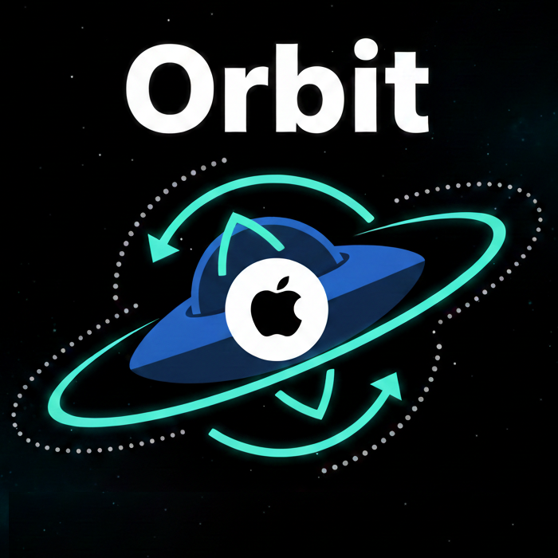

# Orbit 文档索引

  

> **最后更新：** 2026-01-27

---

## 📚 核心文档

### 快速开始

| 文档 | 描述 | 受众 |
|------|------|------|
| [README](../README_CN.md) | 项目概述和快速入门 | 所有用户 |
| [快速入门指南](QUICKSTART_CN.md) | 5分钟上手教程 | 新用户 |
| [API 参考文档](API_REFERENCE_CN.md) | 完整 API 文档 | 开发者 |

### 核心设计

| 文档 | 描述 | 受众 |
|------|------|------|
| [设计文档](DESIGN_CN.md) | 技术架构和设计 | 架构师、开发者 |
| [安全模型](SECURITY_CN.md) | 安全架构和最佳实践 | 安全意识用户 |
| [卫星参考](SATELLITES_CN.md) | 100+ 卫星完整列表 | 所有用户 |

### 品牌与风格

| 文档 | 描述 | 受众 |
|------|------|------|
| [术语表](TERMINOLOGY_CN.md) | Orbit 命名规范 | 所有用户 |

### 贡献指南

| 文档 | 描述 | 受众 |
|------|------|------|
| [贡献指南](CONTRIBUTING_CN.md) | 如何为 Orbit 贡献 | 贡献者 |

---

## 🌍 English Documentation

### Getting Started

| Document | Description | Audience |
|----------|-------------|----------|
| [README](../README.md) | Project overview and quick start | All users |
| [Quick Start Guide](QUICKSTART.md) | 5-minute getting started tutorial | New users |
| [API Reference](API_REFERENCE.md) | Complete API documentation | Developers |

### Core Design

| Document | Description | Audience |
|----------|-------------|----------|
| [Design Document](DESIGN.md) | Technical architecture and design | Architects, developers |
| [Security Model](SECURITY.md) | Security architecture and best practices | Security-conscious users |
| [Satellites Reference](SATELLITES.md) | Complete list of 100+ satellites | All users |

### Brand & Style

| Document | Description | Audience |
|----------|-------------|----------|
| [Brand Guidelines](BRAND.md) | Logo, colors, terminology | Designers, contributors |
| [Terminology](TERMINOLOGY.md) | Orbit naming conventions | All users |

### Contributing

| Document | Description | Audience |
|----------|-------------|----------|
| [Contributing Guide](CONTRIBUTING.md) | How to contribute to Orbit | Contributors |

---

## 🔍 快速导航

### 按主题

**面向用户：**
- 想快速开始？ → [快速入门指南](QUICKSTART_CN.md)
- 需要 API 文档？ → [API 参考文档](API_REFERENCE_CN.md)
- 想了解安全？ → [安全模型](SECURITY_CN.md)

**面向开发者：**
- 架构详情？ → [设计文档](DESIGN_CN.md)
- 想贡献代码？ → [贡献指南](CONTRIBUTING_CN.md)
- 品牌指南？ → [品牌指南](BRAND_CN.md)

**面向英语用户：**
- Quick Start → [Quick Start Guide](QUICKSTART.md)
- API Docs → [API Reference](API_REFERENCE.md)
- Design → [Design Document](DESIGN.md)

### 按文档类型

**概览文档：**
- [README](../README_CN.md) / [README](../README.md)
- [设计文档](DESIGN_CN.md) / [Design Document](DESIGN.md)

**参考文档：**
- [API 参考](API_REFERENCE_CN.md) / [API Reference](API_REFERENCE.md)
- [卫星参考](SATELLITES_CN.md) / [Satellites](SATELLITES.md)
- [术语表](TERMINOLOGY_CN.md) / [Terminology](TERMINOLOGY.md)

**指南文档：**
- [快速入门](QUICKSTART_CN.md) / [Quick Start](QUICKSTART.md)
- [安全模型](SECURITY_CN.md) / [Security](SECURITY.md)
- [贡献指南](CONTRIBUTING_CN.md) / [Contributing](CONTRIBUTING.md)

---

## 📊 文档统计

| 类别 | 中文 | 英文 | 总计 |
|------|------|------|------|
| 核心文档 | 6 | 6 | 12 |
| 指南 | 3 | 3 | 6 |
| 参考文档 | 3 | 3 | 6 |
| **总计** | **12** | **12** | **24** |

---

## 🔄 文档版本

| 文档 | 版本 | 最后更新 |
|------|------|----------|
| README | 1.0.0 | 2026-01-27 |
| 设计文档 | 1.0.0 | 2026-01-27 |
| 快速入门 | 1.0.0 | 2026-01-27 |
| API 参考 | 1.0.0 | 2026-01-27 |
| 安全模型 | 1.0.0 | 2026-01-27 |
| 品牌指南 | 1.0.0 | 2026-01-27 |
| 术语表 | 1.0.0 | 2026-01-27 |
| 卫星参考 | 1.0.0 | 2026-01-27 |
| 贡献指南 | 1.0.0 | 2026-01-27 |

---

## 💡 使用提示

1. **从这里开始** - 新用户应先阅读[快速入门指南](QUICKSTART_CN.md)
2. **语言切换** - 使用上方链接在中英文版本间切换
3. **搜索** - 使用 Ctrl+F (Cmd+F) 在文档内搜索
4. **贡献** - 想帮助改进文档？查看[贡献指南](CONTRIBUTING_CN.md)

---

## 📞 需要帮助？

- **问题反馈**: https://github.com/xiaoxiath/orbit/issues
- **讨论区**: https://github.com/xiaoxiath/orbit/discussions
- **电子邮件**: support@orbit.dev

---

**索引版本：** 1.0.0
**最后更新：** 2026-01-27
